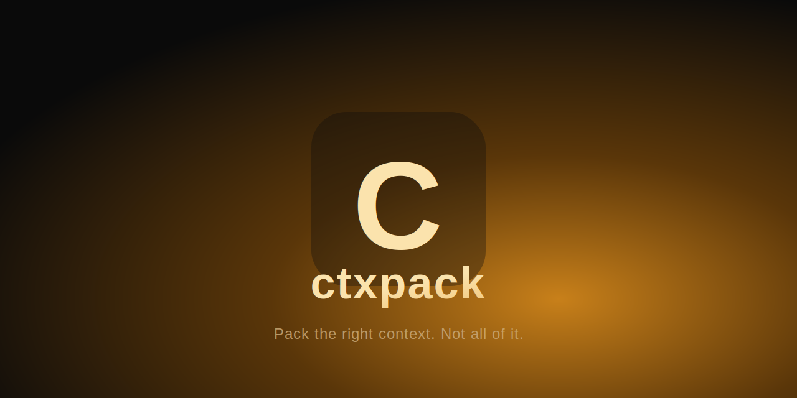

<p align="center">
  
</p>

# ctxpack

A Chrome extension + local companion server that packs the most relevant
files from a local repo into a token-budgeted bundle for Claude — so you stop
hand-picking files for browser chats.

Describe your task, pick a token budget, and ctxpack scans your repo, ranks
files/chunks by relevance using hybrid retrieval (BM25 + local embeddings),
and assembles the highest-relevance content into a bundle you can copy to
your clipboard or inject directly into a claude.ai chat.

## How it works

1. **Scan** — point the extension at a local repo path. A local FastAPI
   server walks the tree, chunks source files, and embeds them
   (`sentence-transformers/all-MiniLM-L6-v2`, entirely local — no API key
   needed).
2. **Describe your task** — type what you're trying to do in the popup.
3. **Pack** — the server ranks chunks with hybrid retrieval (vector
   similarity + BM25 keyword search, merged via reciprocal rank fusion) and
   greedily assembles the top-ranked content into a bundle that fits your
   chosen token budget.
4. **Use it** — copy the bundle to your clipboard, or inject it straight into
   the claude.ai composer with one click.

Everything runs locally: your code is scanned, embedded, and ranked on your
own machine by the companion server. Nothing is sent anywhere except the
bundle you choose to paste/inject into claude.ai yourself.

## Project layout

```
extension/   Chrome extension (MV3): React 19 + TypeScript + Tailwind v4
server/      Local FastAPI companion server (Python, managed with uv)
ARCHI.md     Living architecture doc — read this first
PLAN.md      Living project plan / phase checklist
```

## Getting started

**1. Start the companion server**

```bash
cd server
uv sync
uv run uvicorn app.main:app --reload --port 8000 --host 127.0.0.1
```

See [server/README.md](server/README.md) for details.

**2. Build and load the extension**

```bash
cd extension
npm install
npm run build
```

Then in Chrome: `chrome://extensions` → enable "Developer mode" → "Load
unpacked" → select `extension/dist/`.

See [extension/README.md](extension/README.md) for details.

**3. Use it**

Open the extension popup, scan a local repo path, type a task description,
pick a token budget, and hit Pack Context.

## Documentation

- [ARCHI.md](ARCHI.md) — architecture, tech stack, and the reasoning behind
  each design decision.
- [PLAN.md](PLAN.md) — phased project plan and progress checklist.

## Status

Core engine, extension UI, and claude.ai injection are all working (Phases
0–3 of `PLAN.md`). Currently in the dogfooding phase — see `PLAN.md` §7 for
what's next.
